# SOUL CORE Web Platform

## Full-Stack Web Application | Next.js + FastAPI

### [🔗 Live Demo: soulcore-web.vercel.app](https://soulcore-web.vercel.app)

---

## Overview

Modern, production-ready web platform built with cutting-edge technologies. Full-stack architecture with separate frontend and backend services, deployed on cloud infrastructure.

---

## System Architecture

```mermaid
flowchart TB
    subgraph CLIENT["🌐 Client"]
        BROWSER[Browser]
    end

    subgraph FRONTEND["⚡ Frontend - Vercel"]
        NEXT[Next.js 14<br/>App Router]
        SSR[Server-Side<br/>Rendering]
        STATIC[Static<br/>Assets]
    end

    subgraph BACKEND["🔧 Backend - Railway"]
        FAST[FastAPI<br/>Python 3.11]
        AUTH[Auth<br/>Middleware]
        ROUTES[API<br/>Routes]
    end

    subgraph DATA["💾 Data - Supabase"]
        PG[(PostgreSQL)]
        STORE[Storage]
        SUPA_AUTH[Auth<br/>Service]
    end

    BROWSER --> NEXT
    NEXT --> SSR
    NEXT --> STATIC
    NEXT <--> FAST
    FAST --> AUTH --> ROUTES
    ROUTES --> PG
    ROUTES --> STORE
    AUTH <--> SUPA_AUTH

    style CLIENT fill:#e3f2fd
    style FRONTEND fill:#e8f5e9
    style BACKEND fill:#fff3e0
    style DATA fill:#fce4ec
```

---

## Request Flow

---

## Tech Stack

| Layer | Technology | Purpose |
|-------|------------|---------|
| **Frontend** | Next.js 14 | React framework with SSR |
| **Styling** | Tailwind CSS | Utility-first CSS |
| **UI Components** | shadcn/ui | Accessible components |
| **Language** | TypeScript | Type safety |
| **Backend** | FastAPI | High-performance API |
| **Database** | PostgreSQL | Relational database |
| **BaaS** | Supabase | Auth + DB + Storage |
| **Frontend Host** | Vercel | Edge deployment |
| **Backend Host** | Railway | Container platform |

---

## Project Structure

```mermaid
flowchart TB
    subgraph ROOT["📁 Project Root"]
        subgraph FE["frontend/"]
            APP[app/<br/>Pages & Routes]
            COMP[components/<br/>UI Components]
            LIB[lib/<br/>Utilities]
            STYLES[styles/<br/>Global CSS]
        end

        subgraph BE["backend/"]
            MAIN[app/<br/>Main App]
            API[api/<br/>Endpoints]
            MODELS[models/<br/>Data Models]
            SERVICES[services/<br/>Business Logic]
        end

        SHARED[shared/<br/>Common Schemas]
        DOCS[docs/<br/>Documentation]
    end

    style ROOT fill:#f5f5f5
    style FE fill:#e3f2fd
    style BE fill:#fff3e0
```

---

## Key Features

---

## Deployment Pipeline

---

## API Design

---

## Development Standards

---

## Capabilities Demonstrated

- **Full-Stack Development** - Complete frontend and backend implementation
- **Modern React** - Next.js 14 with App Router and Server Components
- **API Design** - RESTful API with FastAPI and automatic documentation
- **Database Design** - PostgreSQL with proper schema design
- **Cloud Deployment** - Multi-service deployment with CI/CD
- **UI/UX** - Modern, responsive design with accessibility

---

**Technologies:** Next.js | TypeScript | FastAPI | Python | PostgreSQL | Tailwind CSS | Vercel | Railway

**Category:** Web Development | Full-Stack | Cloud Architecture

---

*This project demonstrates capability to build and deploy production-ready full-stack web applications with modern technologies.*
